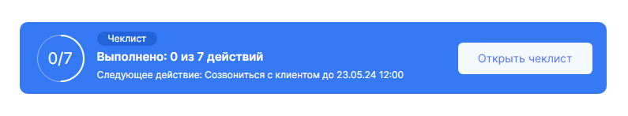

# Website test project
> HTML + CSS (using BEM and Perfect Pixel + Svg progress bar)

Techs/tools used for this Figma layout task:

- HTML
- CSS

## Demo




## Installing / Getting started

1. Clone the repo
   ```sh
   git clone https://github.com/AkaNPC/Card-task-Figma-Html-CSS.git
   ```
2. Open projects directory
   ```sh
   cd Card-task-Figma-Html-CSS/
   ```

## Features

- In CSS file i reset default styles (please check comments in CSS file)
- Change CSS variable (--percentage-value) for rendering current progress (values from 0 to 100 %) in SVG circle
- CSS variable --current-bar-progress contains calc() method with math formula for getting current progress value

## File Structure

 ```sh
📦html-test-task
 ┣ 📂css
 ┃ ┗ 📜style.css
 ┣ 📂img
 ┃ ┗ 📜layout task.png
 ┣ 📜index.html
 ┗ 📜README.md
   ```

## Links

Project homepage: https://github.com/AkaNPC/Card-task-Figma-Html-CSS
